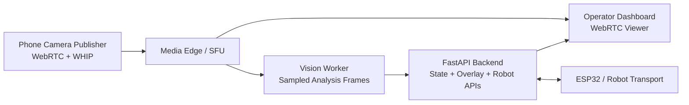

# SketchBot Web Video Architecture

## Goal

Move SketchBot camera transport from ad hoc image upload / MJPEG assumptions to a modern low-latency web video architecture suitable for:

- phone as primary camera
- smooth operator preview
- AprilTag localization
- future internet deployment
- standards-aligned ingest and delivery

This document is intentionally focused on the camera/video subsystem, not the full robot stack.

## Why the current approach is not enough

The current `browser-camera` prototype works by:

1. capturing frames with `getUserMedia()`
2. drawing them to a canvas
3. encoding each frame as JPEG
4. uploading each JPEG via `fetch()`
5. decoding each frame on the backend
6. running AprilTag detection synchronously
7. re-serving the result as a dashboard feed

That path is useful as a proof of concept, but it is not a real streaming architecture.

Main limitations:

- poor latency
- low effective frame rate
- excessive encode/decode churn
- high bandwidth per useful frame
- no adaptive bitrate / congestion control
- viewing and analysis are tightly coupled
- mobile browser camera access requires HTTPS anyway

For a moving robot, this is not the right long-term transport model.

## Recommended standards and protocols

For the live video path, SketchBot should adopt:

- `WebRTC` for low-latency interactive video
- `RTP/SRTP` for media transport
- `ICE/STUN/TURN` for connectivity and NAT traversal
- `WHIP` for browser-to-media-server ingest when we standardize publisher ingestion

Protocol roles:

- `WebRTC` is the right protocol for live operator video
- `WHIP` is the right standards-aligned ingest layer for the phone publisher
- `WebSocket` remains appropriate for app state, telemetry, and robot commands
- `HLS` is not appropriate for primary operator control due to higher latency

## Core design decision

Separate the system into two distinct video paths:

1. `Operator viewing path`
   The dashboard sees a smooth live WebRTC stream.

2. `Vision analysis path`
   The backend receives reduced-rate or reduced-resolution analysis frames for AprilTag detection.

This is the key architectural shift. Human viewing and robot localization should not compete on the exact same transport and frame-processing path.

## Target architecture

## Component responsibilities

### Phone publisher

The phone should become a dedicated publisher, not a dashboard clone.

Responsibilities:

- request device camera permission
- choose front/back camera
- publish video via WebRTC
- expose connection health to the operator

Non-responsibilities:

- AprilTag detection
- state normalization
- overlay logic
- robot command logic

### Media edge / SFU

This layer is responsible for media transport and fan-out.

Responsibilities:

- accept WebRTC ingest from phone
- redistribute video to dashboard viewers
- provide stream health / connection metadata
- optionally expose sampled or transcoded frames to the vision path

Why an SFU or media edge exists:

- it decouples camera publishing from backend application logic
- it scales better than embedding all media concerns directly into FastAPI
- it keeps the live viewing path smooth even when CV load spikes

### Vision worker

This layer is responsible for analysis, not user-facing streaming.

Responsibilities:

- subscribe to sampled frames or a lower-resolution stream
- run AprilTag detection
- infer canvas border
- estimate robot heading
- publish localization results into backend state

Design note:

The vision worker should not try to process every full-resolution display frame. It should process the minimum useful frame stream needed for stable localization.

### FastAPI backend

The backend remains the application source of truth.

Responsibilities:

- canonical state model
- overlays and composition state
- task/job state
- operator-facing camera source metadata
- robot transport and supervision APIs
- websocket state updates to the dashboard

The backend should not remain the main live video transport path.

### Dashboard

The dashboard remains the operator control surface.

Responsibilities:

- render live WebRTC video
- display localization overlays
- show camera source / health / status
- show task and robot state
- let the operator choose active source

## Recommended deployment model

### Frontend

- deploy `webapp/` on Vercel

### Backend API

- deploy `backend/` on Render, Railway, or Fly.io
- use Docker for reproducible Python/media dependencies

### Media layer

- deploy separately from the application backend
- do not try to force the full media path through standard serverless frontend hosting

Recommended production shape:

- `Vercel` for Next.js frontend
- `Render` or `Fly.io` for FastAPI backend
- separate `WebRTC media service / SFU`

## Technology recommendation

For SketchBot, the architecture should target:

- `phone -> WebRTC publisher`
- `publisher -> media server via WHIP`
- `dashboard -> media server via WebRTC viewer`
- `vision worker -> sampled frames from media server`
- `backend -> state + overlays + robot supervision`

This is the most standards-aligned direction available to us today without locking the project into an improvised transport.

## Internal code refactor direction

### Current code

Current code mixes together:

- source selection
- frame ingestion
- frame storage
- OpenCV analysis
- stream serving

The most overloaded part today is `backend/app/services/camera_service.py`.

### Desired code split

#### `backend/app/services/camera_service.py`

Should become a camera source coordinator and status service.

Responsibilities:

- active source selection
- source health summary
- metadata about active stream
- analysis frame bookkeeping
- bridge between media layer and backend state

Should no longer own:

- primary live transport
- long-running Pi-only assumptions
- the operator preview stream implementation

#### New backend service: `media_session_service.py`

Suggested responsibilities:

- media session registration
- publisher/viewer session metadata
- stream identifiers
- ingest configuration returned to phone publisher page
- health / diagnostic signals

#### Existing `apriltag_service.py`

Should stay focused on vision logic, but be invoked from an analysis pipeline instead of directly from a live preview upload path.

#### Frontend `webapp/src/app/page.tsx`

Should eventually stop owning transport details directly.

Refactor into:

- dashboard shell
- camera source panel
- WebRTC viewer hook
- overlay layer
- task workflow panels

#### Frontend `webapp/src/app/camera/remote/page.tsx`

Should evolve from JPEG uploader to WebRTC publisher page.

Responsibilities after refactor:

- publisher setup
- device selection
- preview
- publish start/stop
- stream health / reconnect UI

## Source model after refactor

Camera sources should remain explicit in state:

- `browser-camera`
- `phone-webrtc`
- `kit-webrtc`
- `external-camera`
- `demo`

Notes:

- `browser-camera` can back tablet, laptop, or USB-camera capture flows while a richer companion experience evolves
- `kit-webrtc` is the reserved path for future certified hardware bundles
- `external-camera` should eventually mean an external standards-based video source, not just a URL preview field

## Overlay strategy

Overlays should remain backend-driven.

Operator video should stay cleanly separated from overlay state:

- live stream rendered by WebRTC
- overlay geometry rendered by the dashboard
- localization state updated from backend websocket snapshots

This allows:

- smooth video without re-encoding annotated frames
- consistent overlay presentation
- easier debugging of video vs. localization issues

## Security and connectivity requirements

For production phone-camera support:

- frontend must be served over HTTPS
- WebRTC must use STUN
- TURN should be considered required for reliable off-LAN connectivity
- backend and media services must expose clear public URLs

On local development:

- `localhost` works for desktop camera experiments
- phone camera publishing over plain LAN HTTP is not sufficient due to secure-context requirements

## Migration plan

### Phase 0: stabilize current prototype

Status:

- source selection exists
- phone JPEG upload prototype exists
- dashboard can switch sources

Purpose:

- prove source switching and state model direction

### Phase 1: introduce media abstraction

Tasks:

- stop treating `camera_service` as the full media stack
- add explicit media session metadata in backend state
- define stream identifiers and source health fields

Exit criteria:

- backend can describe a live stream without being the stream itself

### Phase 2: replace JPEG upload with WebRTC publisher

Tasks:

- rebuild `/camera/remote` as a WebRTC publisher page
- negotiate publishing to a media service
- keep phone camera UI small and purpose-built

Exit criteria:

- phone publishes a smooth live stream without snapshot uploads

### Phase 3: add dashboard WebRTC viewer

Tasks:

- replace dashboard fallback preview for phone source with WebRTC viewer
- keep overlay rendering local in the UI

Exit criteria:

- dashboard can watch phone source smoothly

### Phase 4: add sampled vision analysis

Tasks:

- introduce analysis frame subscription / sampling
- run AprilTag detection on the analysis path
- update state independently from display cadence

Exit criteria:

- localization remains stable while operator video stays smooth

### Phase 5: production hardening

Tasks:

- deploy frontend over HTTPS
- deploy backend separately
- deploy media service
- add STUN/TURN
- add diagnostics and reconnect handling

Exit criteria:

- reliable phone camera operation across real-world networks

## Non-goals

This document does not lock:

- the exact SFU/media vendor
- the exact TURN provider
- the exact deployment host for the media edge

Those can be decided after we complete the contract and integration design.

## Immediate next implementation tasks

1. define the backend state contract for media sessions and camera source health
2. refactor `camera_service.py` into coordination rather than transport ownership
3. define a `phone-webrtc` source contract
4. rebuild `/camera/remote` as a real publisher page
5. add a dashboard viewer hook that consumes a WebRTC stream
6. move AprilTag detection onto a sampled analysis path

## Recommended decision

SketchBot should adopt:

- `WebRTC` as the canonical live video transport
- `WHIP` as the preferred standards-aligned ingest direction
- backend-managed overlay and state synchronization
- separate analysis and viewing paths

This is the right architecture if the goal is a serious, modern, low-latency robot camera system rather than a temporary camera upload demo.
